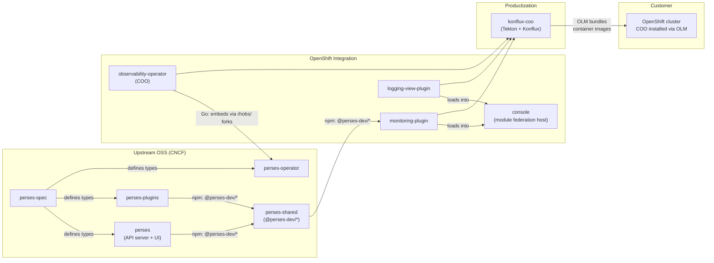

# Architecture

This repository is a monorepo of git submodules for the Observability UI team at Red Hat. It contains 10 projects spanning OpenShift Console plugins,
the Perses open-source dashboarding platform (CNCF Sandbox), Kubernetes operators, and Red Hat productization pipelines. The repo itself provides AI
agent tooling (`claude/plugins/`) and structured task tracking (`tasks/` directory with a spec, plan, execution workflow).

Projects are organized as git submodules under `projects/`. Each project has its own repository, CI/CD, and release cycle. Projects span three GitHub
organizations with different CI systems and contributor workflows: `openshift/` (console, plugins — Prow CI), `perses/` (upstream Perses ecosystem —
GitHub Actions), and `rhobs/` (operators, productization — GitHub Actions and Konflux).

## Project Catalog

| Project                                                   | Repository                    | Stack               | Purpose                                                                                                                                                  |
| --------------------------------------------------------- | ----------------------------- | ------------------- | -------------------------------------------------------------------------------------------------------------------------------------------------------- |
| [console](projects/console)                               | openshift/console             | Go, React/TS        | OpenShift Web Console. Runtime host for dynamic plugins via webpack module federation.                                                                   |
| [konflux-coo](projects/konflux-coo)                       | rhobs/konflux-coo             | Dockerfiles, Tekton | Red Hat productization pipeline for COO. Builds container images, OLM bundles, and catalogs via Konflux CI/CD.                                           |
| [logging-view-plugin](projects/logging-view-plugin)       | openshift/logging-view-plugin | Go, React/TS        | Console dynamic plugin for logging using Loki stack as a backend with the Loki Operator. Deploys via COO.                                                |
| [monitoring-plugin](projects/monitoring-plugin)           | openshift/monitoring-plugin   | Go, React/TS        | Console dynamic plugin for metrics, alerts, silences, targets, and dashboards (Perses + legacy). Depends on `@perses-dev/*` packages. Deploys via COO.   |
| [observability-operator](projects/observability-operator) | rhobs/observability-operator  | Go                  | Cluster Observability Operator (COO). Manages monitoring stacks and embeds perses-operator. Deploys via OLM.                                             |
| [perses](projects/perses)                                 | perses/perses                 | Go, React/TS        | Open-source dashboarding platform (CNCF Sandbox). API server, CLI, and main UI.                                                                          |
| [perses-operator](projects/perses-operator)               | perses/perses-operator        | Go                  | Kubernetes operator for Perses CRDs: Perses, PersesDashboard, PersesDatasource, PersesGlobalDatasource.                                                  |
| [perses-plugins](projects/perses-plugins)                 | perses/plugins                | React/TS            | Core Perses plugin modules: datasources (prometheus, loki, tempo, pyroscope, clickhouse, victorialogs), panels, variables, and explore pages.            |
| [perses-shared](projects/perses-shared)                   | perses/shared                 | React/TS, Turborepo | Published as `@perses-dev/*` npm packages: components, dashboards, explore, plugin-system. Consumed by perses UI, perses-plugins, and monitoring-plugin. |
| [perses-spec](projects/perses-spec)                       | perses/spec                   | CUE, Go, TS         | CUE specifications for Perses resources. Generated into Go and TypeScript types.                                                                         |

## Dependencies and Feature Delivery

The diagram below shows how projects depend on each other and how a feature moves from upstream code to customer clusters. Read left-to-right to
follow the delivery lifecycle; edges show dependency and integration relationships.

Key relationships:

- **perses-shared is the cross-cutting dependency.** Its `@perses-dev/*` npm packages are consumed by three projects: the perses UI, perses-plugins,
  and the monitoring-plugin. Version alignment across these consumers is critical.
- **observability-operator embeds perses-operator** as a Go module dependency via `rhobs/` forks. When COO is installed in an OpenShift cluster, it
  can manage Perses instances, dashboards, and datasources via Kubernetes CRDs.
- **Console hosts plugins at runtime** via webpack module federation. The monitoring-plugin and logging-view-plugin are built and released
  independently from Console, then loaded dynamically.
- **konflux-coo is the single productization pipeline.** It builds container images for observability-operator, UI plugins, and all supporting
  components (prometheus, alertmanager, thanos, korrel8r), producing OLM bundles and catalogs pushed to Quay.

### Feature delivery stages

1. **Upstream development.** Features are built in Perses ecosystem repos (perses, perses-shared, perses-plugins, perses-spec, perses-operator). These
   are open-source CNCF projects with their own release cycles.
2. **OpenShift integration.** Changes flow into monitoring-plugin via `@perses-dev/*` npm packages and into observability-operator via Go module
   dependencies on `rhobs/` forks (see [rhobs/ forks](#rhobs-forks) below). UI plugin features may also require Console SDK changes for new extension
   points.
3. **Productization.** konflux-coo builds container images from all components using Tekton pipelines, produces OLM bundles and catalogs, and pushes
   to the Quay registry.
4. **Delivery.** COO is installed on OpenShift clusters via OLM. UIPlugin custom resources install the monitoring and logging plugins into Console.
   Customers interact with observability features through the Console UI.

## Observability UI Plugins

The monitoring-plugin and logging-view-plugin are OpenShift Console dynamic plugins built with webpack module federation. Console loads them at
runtime without requiring a Console rebuild or redeployment. Each plugin is a container image with a Go backend that serves the static frontend assets
and proxies API requests. Plugins interact with Console through `@console/dynamic-plugin-sdk`, which is the public API surface for extension points,
hooks, and shared utilities.

### Deployment modes

Plugins are deployed through two paths:

- **CMO-managed (monitoring-plugin core).** The Cluster Monitoring Operator (CMO) manages the core monitoring-plugin deployment. This is the default
  monitoring UI shipped with every OpenShift cluster.
- **COO-managed (monitoring-console-plugin, logging-view-plugin).** When COO is installed, UIPlugin custom resources install additional plugin
  instances. The monitoring-console-plugin is a COO-managed variant of the monitoring-plugin that includes extra features not in the CMO-managed core.

### Compatibility matrix and feature flags

A single COO release runs across multiple OpenShift versions. Since Console introduces breaking changes between versions (e.g., PatternFly upgrades),
the observability-operator uses a compatibility matrix to select the right plugin image and feature flags for each cluster version at reconciliation
time. This applies to all UI plugin types (dashboards, troubleshooting-panel, distributed-tracing, logging, monitoring). Each plugin type also has its
own controller that can dynamically inject additional feature flags based on UIPlugin CR config and cluster version.

Key files in observability-operator:

- `pkg/controllers/uiplugin/compatibility_matrix.go` — maps plugin type + version range to image key and static feature flags.
- `pkg/controllers/uiplugin/` — per-plugin controller files (e.g., `monitoring.go`, `logging.go`) handle dynamic feature injection.
- `cmd/operator/main.go` — default image map resolving image keys to container image URLs.

## Perses Ecosystem

Perses is a CNCF Sandbox project for creating and managing dashboards and visualizations. The ecosystem spans five repositories in this harness.

**perses** is the main repository containing the Go backend (API server + CLI) and the React frontend (`ui/`). At startup, the API server installs
plugin code modules based on `scripts/plugin/plugin.yaml`, which lists plugins and their versions. If not already present, it downloads plugin
tarballs from GitHub releases, decompresses and validates them, then starts serving. The UI loads plugins on demand via webpack module federation when
a dashboard or explore page is rendered.

**perses-shared** is a Turborepo monorepo publishing `@perses-dev/*` npm packages: `components` (reusable React UI components), `dashboards` (context
providers and utilities for rendering dashboards), `explore` (explore page components), and `plugin-system` (plugin lifecycle management and module
federation host). These packages are the shared foundation consumed by the perses UI, perses-plugins, and the monitoring-plugin for embedded dashboard
rendering in OpenShift Console.

**perses-plugins** contains the core plugin modules organized by type: datasources (prometheus, loki, tempo, pyroscope, clickhouse, victorialogs),
panels (timeseries, bar, gauge, heatmap, stat, table, markdown, pie, scatter, flame, status-history, and more), variables (datasource, static-list),
and explore pages.

**perses-spec** defines the canonical CUE specifications for Perses resources (dashboards, datasources, panels, variables). These specs are generated
into Go, TypeScript, and Java types, consumed by perses, perses-operator, and perses-plugins.

**perses-operator** manages Perses resources in Kubernetes via four CRDs: `Perses` (server deployment), `PersesDashboard` (dashboard sync),
`PersesDatasource` (project-scoped datasource), and `PersesGlobalDatasource` (cluster-scoped datasource). It is embedded by observability-operator.

### rhobs/ forks

For productization, `rhobs/perses` and `rhobs/perses-operator` forks exist with `release-coo-*` branches. These forks rewrite Go module paths from
`github.com/perses/*` to `github.com/rhobs/*` and remove upstream CI configuration. The observability-operator's `go.mod` depends on these forks, not
the upstream repos directly. When upgrading Perses in the operator, the fork branches must be updated first.

## Cross-Project Work

When planning tasks that span multiple projects, these dependency chains matter:

- **Perses package upgrades.** When `@perses-dev/*` packages are updated in perses-shared, both perses-plugins and monitoring-plugin must be updated
  to match. Check version alignment across all three consumers before merging.
- **Operator changes.** Changes to perses-operator CRDs or API types propagate through: upstream perses-operator → rhobs/ fork `release-coo-*`
  branches → observability-operator Go dependencies → observability-operator CRD copies in `deploy/perses/crds/` → konflux-coo Dockerfiles.
- **New plugin features.** Adding a feature to monitoring-plugin or logging-view-plugin may require: Console SDK changes (if new extension points are
  needed), operator changes (if new UIPlugin spec fields), and konflux-coo updates (if new images or pipeline changes).
- **Release alignment.** COO release branches (e.g., `release-1.5`) coordinate versions across observability-operator, rhobs/ forks (e.g.,
  `release-coo-1.5`), and konflux-coo (e.g., `release-1.5`). Feature work should target the correct release branch.

Before starting work on a project, check for `CLAUDE.md` or `AGENTS.md` in the project root — several projects have detailed agent-specific guidance
for building, testing, and navigating the codebase. Each project has its own build and test setup documented in its README. See the
[README](README.md) for the task workflow used to plan and track work across projects.

## Konflux 

### Konflux - Fast Channel vs Stable Channel 
https://github.com/rhobs/observability-operator/pull/1100
Replace the single "stable" channel with two channels:

fast: ships the latest bundle across all OCP versions (same as the previous stable behavior)
stable: can pin different bundle versions per OCP version, controlled by config/channels.yaml
Per-version update scripts (hack/update-bundle-*.sh) replace the single hack/update-catalog.sh, allowing Konflux component updates to target specific bundle versions independently. hack/add-bundle-version.sh automates adding new bundle versions to the template.

Each OCP version now gets its own rendered catalog directory (catalog/coo-product-v4.XX/) instead of sharing two directories.